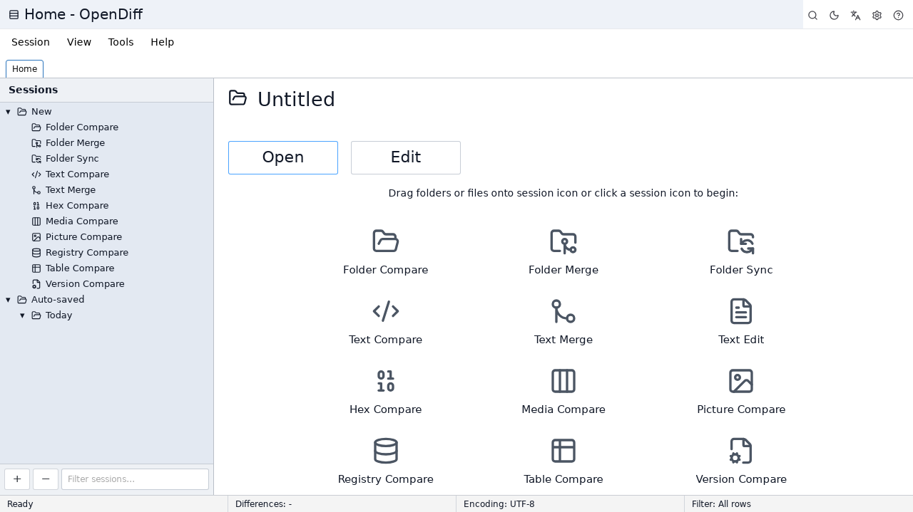
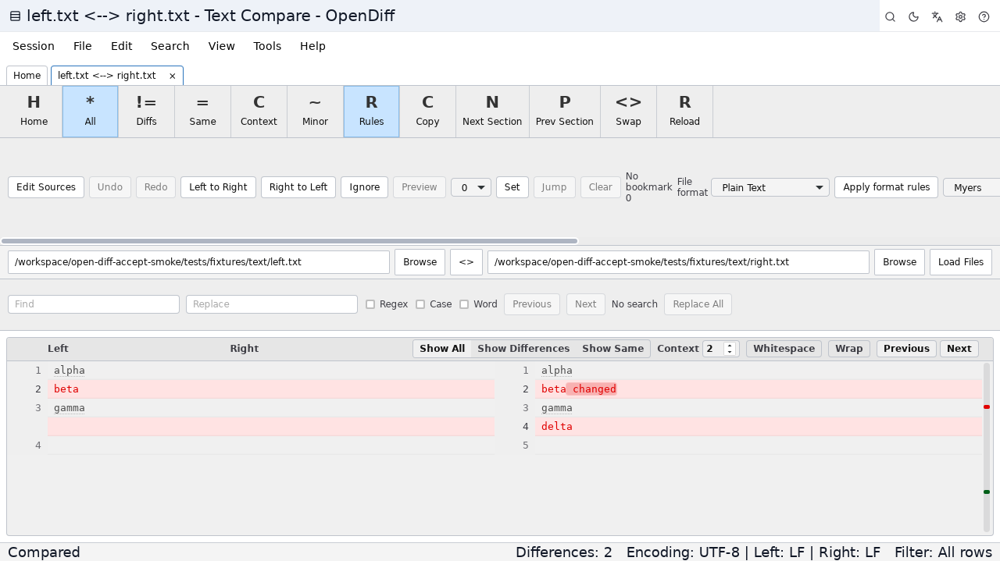
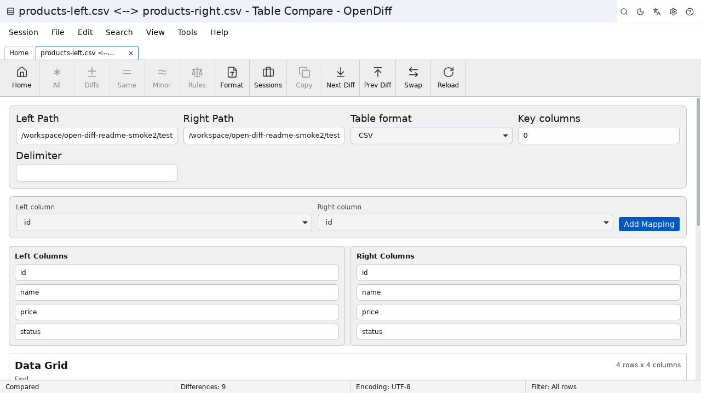
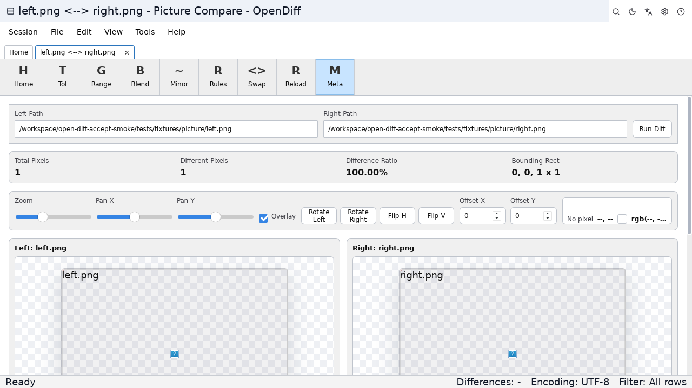
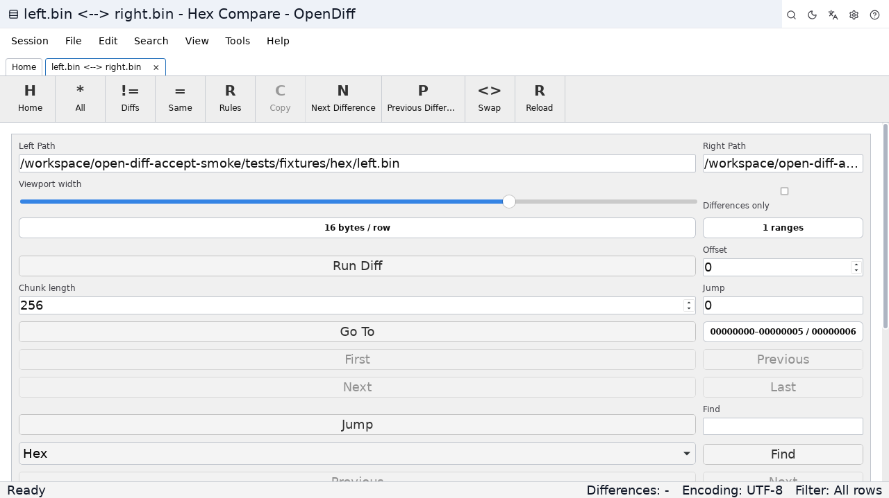
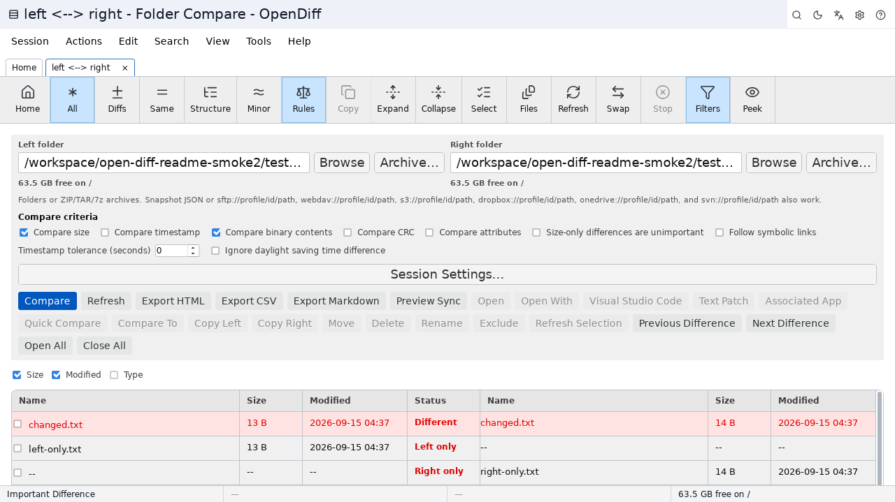

# Open Diff — Open-Source File Compare & Beyond Compare Alternative

Open Diff is an open-source Beyond Compare alternative focused on practical daily file comparison, folder comparison, and three-way merge workflows for people who need to trust every highlighted change before they act on them. It supports text, table, image, hex, and binary comparison on Windows, macOS, and Linux so you can stay in one lightweight desktop tool across formats and platforms. Side-by-side views, folder synchronization, session restore, HTML reports, and command-line helpers help developers, reviewers, content editors, and operators inspect differences clearly before they safely copy, merge, synchronize, or ship.

**Also searched as:** 文件对比 / 檔案比較 / ファイル比較 / 파일 비교 / comparación de archivos / comparateur de fichiers / Dateivergleich / comparação de arquivos / сравнение файлов

## Screenshots

Linux smoke screenshots (Home / Text / Table / Image / Hex / Folder):













## Why Open Diff

- Free and open source under the Apache License 2.0 — a Beyond Compare alternative with installers you can download and build yourself.
- Cross-platform desktop app for Windows, macOS, and Linux instead of juggling separate OS-specific compare tools.
- A practical WinMerge alternative when you want folder comparison and sync together with text, table, image, and hex modes.
- A Meld alternative that keeps side-by-side file comparison while adding structured table and picture workflows.
- A KDiff3 alternative for three-way merge alongside everyday two-pane file comparison.
- Teams evaluating Araxis Merge can try Open Diff when they need open-source licensing and portable session files.
- DiffMerge users get familiar side-by-side layouts for source and config reviews in a modern UI.
- ExamDiff seekers get focused difference navigation for code, logs, and exported data without paying for a license.
- FreeFileSync users can preview copy and delete actions, then apply folder synchronization with progress and logs.
- Built for developers who want clear highlights, saved sessions, reports, and CLI helpers in one place.

## Core Features

### Text File Comparison

Open Diff provides a focused side-by-side text file comparison workflow.

- Compare two text files line by line.
- Highlight inserted, deleted, and modified lines.
- Highlight character-level changes inside modified lines.
- Support syntax highlighting for common programming and markup languages.
- Ignore whitespace-only changes when needed.
- Ignore case-only changes when needed.
- Ignore comments for source-code focused comparisons.
- Navigate to the next or previous difference.
- Search within compared content.
- Jump directly to a line number.
- Display line numbers for both sides.
- Support word wrap for long lines.
- Select file encoding when content is not UTF-8.

### Folder Comparison

Open Diff can compare two folders and show folder comparison results in a structured tree/table view.

- Scan left and right folders recursively.
- Show files that are identical, modified, left-only, or right-only.
- Compare files by size, modified time, or content checksum.
- Filter the view to show all items, only differences, only identical files, left-only files, or right-only files.
- Exclude files by simple glob-like patterns.
- Open matching files from the folder comparison in text comparison mode.
- Copy left-only files to the right side.
- Copy right-only files to the left side.
- Refresh comparison results after file operations.
- Display file size and modified time for both sides.

### Folder Synchronization

Open Diff includes a synchronization workflow for applying folder changes safely.

- Preview synchronization actions before execution.
- Update the right folder from the left folder.
- Update the left folder from the right folder.
- Update both folders using newer or missing files.
- Mirror the right folder from the left folder.
- Mirror the left folder from the right folder.
- Show planned copy and delete actions.
- Track synchronization progress.
- Show operation logs after execution.

### Table and CSV Comparison

Open Diff supports comparing structured tabular data for spreadsheet-style file comparison.

- Compare CSV files.
- Compare TSV files.
- Compare spreadsheet-style data.
- Detect added, deleted, modified, and equal rows.
- Highlight changed cells inside modified rows.
- Show a side-by-side table view.
- Show a unified text-like view for table differences.
- Toggle whether the first row should be treated as headers.
- Choose common delimiters such as comma, tab, and semicolon.

### Image Diff and Picture Comparison

Open Diff supports pixel-oriented image comparison for visual diffs.

- Load two images side by side.
- Compare images at pixel level.
- Show the percentage of differing pixels.
- Detect image size mismatches.
- Optionally include alpha channel differences.
- Display image previews for manual inspection.

### Hex and Binary File Comparison

Open Diff includes a hexadecimal comparison view for binary file comparison.

- Load two binary files.
- Show byte offsets.
- Display hexadecimal byte values.
- Display ASCII representation beside byte values.
- Highlight changed bytes.
- Mark left-only and right-only byte ranges.
- Show basic difference statistics.

### Three-Way Merge

Open Diff is designed to support conflict-resolution merge workflows.

- Use a base version, a left version, and a right version.
- Detect conflicting changes.
- Present resolved and conflicting output sections.
- Help users build a final merged result.

### Session Management

Open Diff can save and restore comparison work.

- Save comparison sessions.
- List recent sessions.
- Reopen previous sessions.
- Delete old sessions.
- Import session data from JSON.
- Export session data to JSON.
- Store comparison configuration with each session.

### Comparison Reports

Open Diff is intended to generate shareable comparison summaries.

- Generate HTML comparison reports.
- Include file labels, statistics, and side-by-side differences.
- Provide print-friendly report styling.
- Use reports for review, audit, or handoff workflows.

### Automation and CLI

Open Diff includes command-line and scripted workflows for the commands that are already implemented.

- Run comparisons from the command line, including `shell-compare`, `open`, `compare [--quiet]`, and `open-diff-cli --help` for session flags and exit codes.
- Install optional macOS/Linux shell helpers (`.desktop` Open With or Open With `.app` stub) from Settings; Windows Explorer verbs remain available.
- Generate machine-readable results.
- Execute supported script commands such as LOAD, COMPARE, REPORT, and SYNC.
- Generate Git difftool, Git mergetool, and Subversion external diff setup commands.

## Translations

Localized overviews with common search phrases for each language:

- [简体中文](docs/readme/README.zh-CN.md) — 文件对比、文件夹比较、合并工具
- [繁體中文](docs/readme/README.zh-TW.md) — 檔案比較、資料夾比對、合併工具
- [한국어](docs/readme/README.ko.md) — 파일 비교, 폴더 비교, 병합
- [Español](docs/readme/README.es.md) — comparación de archivos, carpetas, fusión
- [Français](docs/readme/README.fr.md) — comparaison de fichiers, dossiers, fusion
- [Deutsch](docs/readme/README.de.md) — Dateivergleich, Ordnervergleich, Merge

## Installation

Download this free open-source compare tool for Windows, macOS, and Linux from the
[GitHub Releases](https://github.com/kygo8/open-diff/releases) page.

Release assets are published for supported desktop platforms through the Tauri
release workflow.

## Development

Requirements:

- Node.js LTS
- pnpm through Corepack
- Rust stable toolchain
- Platform dependencies required by Tauri

Install dependencies:

```bash
corepack enable
corepack pnpm install
```

Run the web app during development:

```bash
corepack pnpm dev
```

Run the desktop app during development:

```bash
corepack pnpm tauri:dev
```

Build the frontend:

```bash
corepack pnpm build
```

Build desktop bundles:

```bash
corepack pnpm tauri:build
```

## Quality Checks

Run the full local quality gate before opening a pull request:

```bash
corepack pnpm quality
corepack pnpm test
```

The quality gate includes formatting checks, ESLint, Stylelint, TypeScript type
checking, Rust formatting checks, and Clippy.

## Contributing

Issues and pull requests are welcome. Please read
[CONTRIBUTING.md](CONTRIBUTING.md) before submitting code changes.

- Use the bug report template for reproducible problems.
- Use the feature request template for workflow and product suggestions.
- Report security vulnerabilities privately according to
  [SECURITY.md](SECURITY.md).

## Release Process

Open Diff uses semantic version tags such as `v1.0.0`.

When a `v*` tag is pushed, GitHub Actions builds Tauri bundles for Windows,
macOS (Apple Silicon and Intel), and Linux, creates a GitHub Release, uploads
the generated desktop assets, and generates release notes.

Before creating a release tag, make sure the version is synchronized across:

- `package.json`
- `src-tauri/tauri.conf.json`
- `src-tauri/Cargo.toml`

## Planned Capabilities

These items stay unimplemented and are labeled as such in the UI:

- S3, Dropbox, OneDrive, and SVN remote protocols (FTPS list/read with explicit or implicit TLS is available; not production-hardened).
- Writing/editing entries back into 7z archives (read/list/compare and copy-out are live).
- Remaining automation script language coverage (niche verbs and full legacy dialects). Supported commands run; unknown names return `unsupported`.
- Live Windows registry hives (exported `.reg` files compare).
- Niche shortcut chords and remaining report formats beyond the shipped HTML/text/JSON/XML/CSV exports.

## Typical Use Cases

- Review source code changes before committing.
- Compare generated files or configuration snapshots.
- Synchronize project folders.
- Inspect deployment package differences.
- Compare exported CSV or spreadsheet data.
- Check whether two images are visually or pixel-wise different.
- Inspect binary file changes at byte level.
- Save recurring comparison sessions for repeated work.

## Project Status

Open Diff ships working desktop compare, merge, sync, archive, remote, and
script sessions. Unfinished items are disabled or labeled unimplemented instead
of showing fake success. Download installers from GitHub Releases.

## License

Open Diff is licensed under the [Apache License 2.0](LICENSE).
