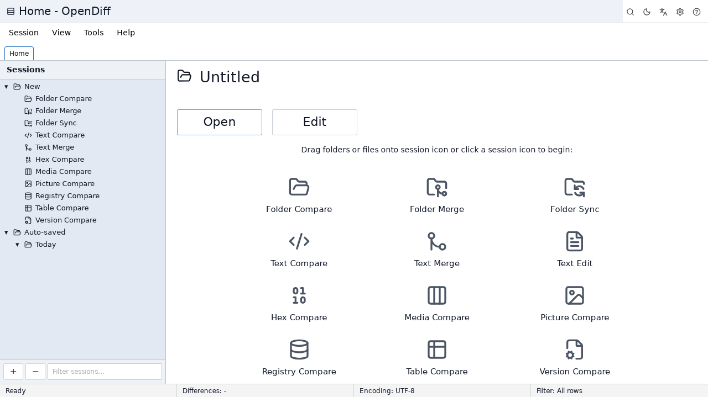
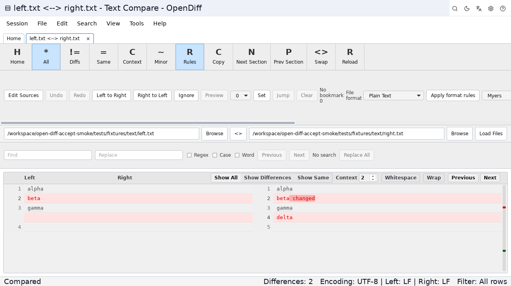
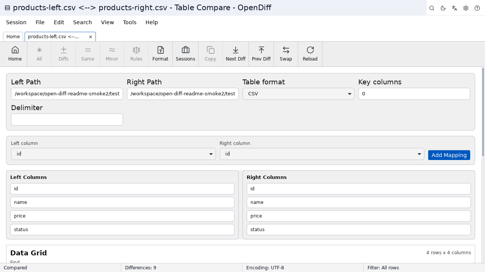
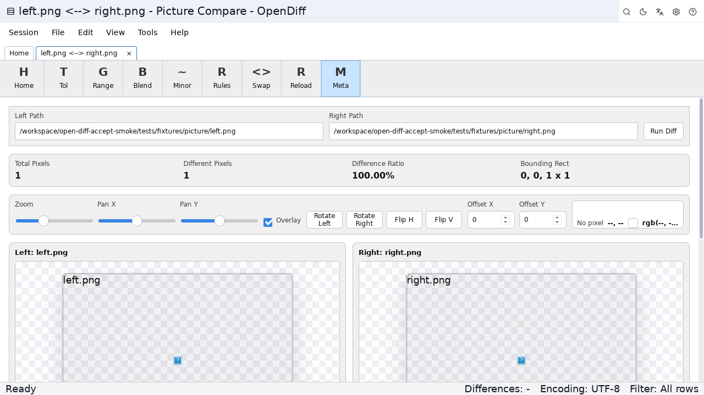
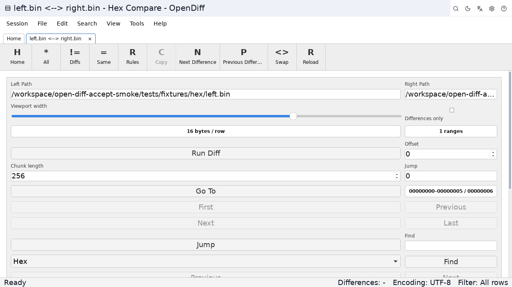
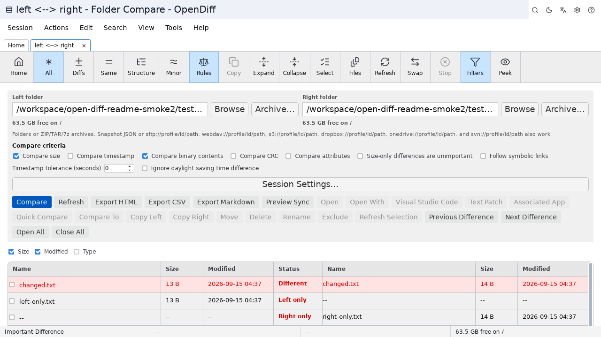

# Open Diff

Open Diff 是一个跨平台差异比较与合并工具，用于比较文件、文件夹、表格、图片和二进制数据。

## 界面预览

Linux 冒烟截图（Home / Text / Table / Image / Hex / Folder）：

## 功能说明

### 文本对比

- 按行比较两个文本文件。
- 高亮新增、删除、修改内容。
- 支持修改行内的字符级差异。
- 支持常见编程语言和标记语言的语法高亮。
- 支持忽略空白、大小写和注释差异。
- 支持差异导航、搜索、跳转行号、行号显示和自动换行。
- 支持选择文件编码。

### 文件夹对比

- 递归扫描左右文件夹。
- 展示相同、修改、仅左侧存在、仅右侧存在的文件。
- 支持按大小、修改时间或内容校验值进行比较。
- 支持按状态过滤显示结果。
- 支持排除指定文件模式。
- 支持从文件夹对比中打开文件级对比。
- 支持基础复制操作。

### 文件夹同步

- 执行前预览复制和删除动作。
- 支持向右更新、向左更新、双向更新。
- 支持向右镜像和向左镜像。
- 展示同步进度和操作日志。

### 表格对比

- 支持 CSV、TSV 和类电子表格数据。
- 检测新增、删除、修改和相同行。
- 高亮修改行中的单元格差异。
- 支持表格视图和统一视图。
- 支持设置分隔符和表头。

### 图片对比

- 左右并排加载两张图片。
- 执行像素级比较。
- 显示差异像素比例。
- 支持检查图片尺寸不一致。
- 可选择是否比较 Alpha 通道。

### 二进制与十六进制对比

- 加载两个二进制文件。
- 显示偏移地址、十六进制字节和 ASCII 内容。
- 高亮差异字节。
- 标记仅左侧或仅右侧存在的字节范围。

### 三方合并

- 支持 base、left、right 三个版本。
- 检测冲突修改。
- 展示已解决和冲突的输出区段。

### 会话管理

- 保存对比会话。
- 查看最近会话。
- 重新打开历史会话。
- 删除旧会话。
- 导入和导出 JSON 会话数据。

### 报告与自动化

- 生成 HTML 对比报告。
- 支持打印友好的报告样式。
- 已支持命令行和已实现的脚本命令（LOAD、COMPARE、REPORT、SYNC 等）。

## 典型使用场景

- 代码变更审查。
- 配置文件对比。
- 项目目录同步。
- 发布包差异检查。
- CSV 或表格数据对比。
- 图片和二进制文件差异检查。

## 下载与安装

请从 [GitHub Releases（Latest）](https://github.com/kygo8/open-diff/releases/latest) 下载对应系统的安装包。

**详细对照（什么样的设备该下什么样的文件）：** [下载说明](../下载说明.md)

| 你的设备                          | 下载文件                                            | 说明                       |
| --------------------------------- | --------------------------------------------------- | -------------------------- |
| Windows 64 位                     | `*_windows_x64.msi` 或 `*_windows_x64_portable.zip` | MSI 安装版；zip 绿色便携版 |
| Mac Apple 芯片（M1/M2/M3/M4/M5…） | `*_darwin_aarch64.dmg`（或 `.app.tar.gz`）          | 苹果菜单 → 关于本机 → 芯片 |
| Mac Intel                         | `*_darwin_x64.dmg`（或 `.app.tar.gz`）              | 不要选 `aarch64`           |
| Linux Debian/Ubuntu 系            | `*_linux_amd64.deb`                                 | 也可用 AppImage 免安装试用 |
| Linux Fedora/RHEL/openSUSE 系     | `*_linux_x86_64.rpm`                                | 也可用 AppImage            |
| 任意 x86_64 Linux（免安装）       | `*_linux_amd64.AppImage`                            | 先 `chmod +x` 再运行       |

请勿下载 Source code（源码包），除非你要自己编译。当前没有 32 位 Windows 或 Linux ARM 预编译包。

## 项目状态

Open Diff 已在 v1.1.1 发布安装包，并提供可用的桌面比较、合并、同步、压缩包、远程和脚本功能。未完成的功能会禁用或标明「未实现」，不会假装成功。安装包请从 GitHub Releases 下载。
